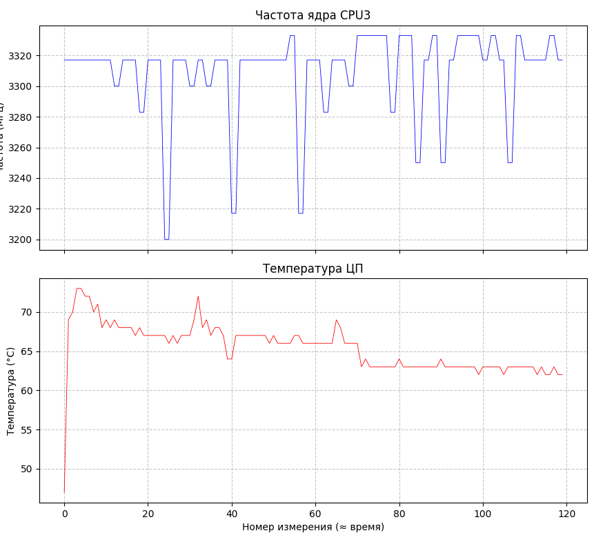
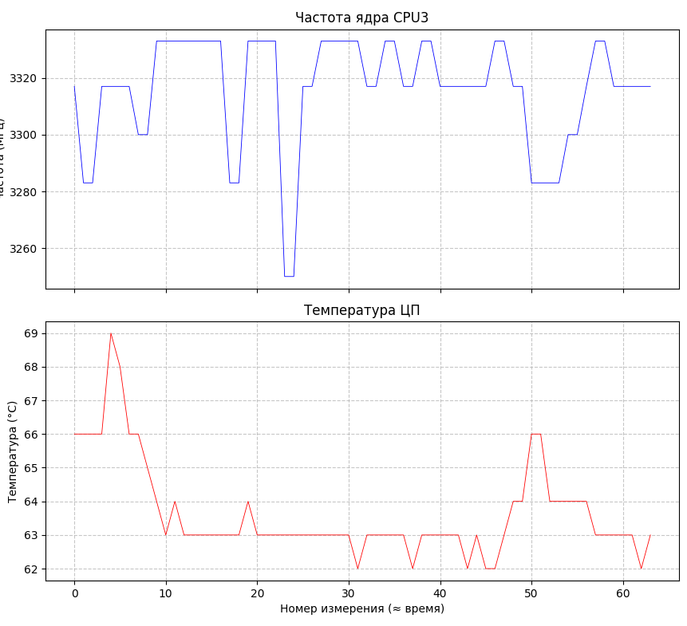
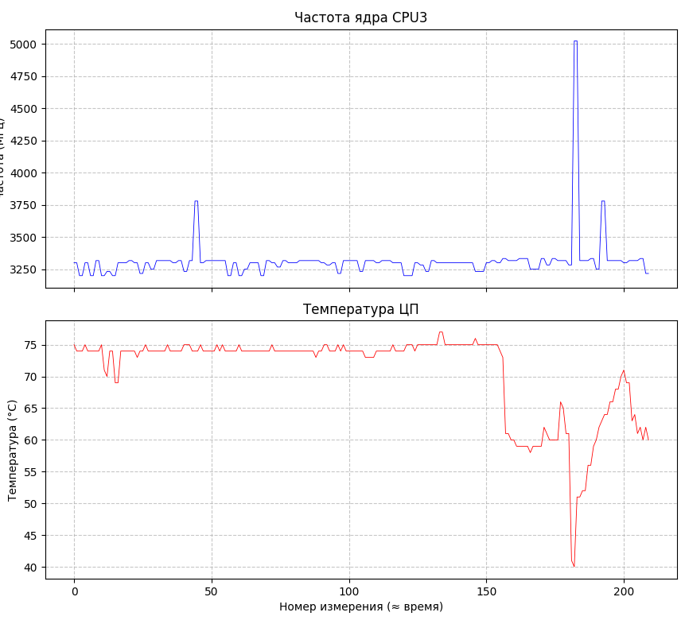
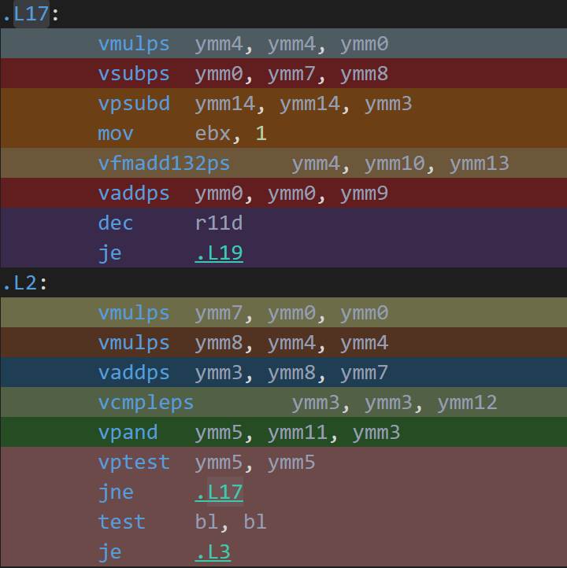

# Лабораторная работа: Ускорение вычислений множества Мандельброта с помощью SIMD-инструкций

## Цели и задачи
1. Реализовать программу с большим объёмом вычислений (отрисовка множества Мандельброта).
2. Исследовать влияние различных подходов к векторизации на производительность:
   - автоматическая векторизация компилятором на основе циклов с массивами (`Quad`);
   - ручная векторизация с использованием Intel Intrinsics (`AVX2`).
3. Оценить влияние флагов оптимизации компилятора (`-O0`, `-O2`, `-O3`).

## Параметры системы
| Параметр | Значение |
|----------|----------|
| Система | Windows 11 Pro |
| Процессор | AMD Ryzen 7 8845HS (Zen 4, 8 ядер / 16 потоков, базовая частота 3.3 ГГц, макс. буст 5.1 ГГц) |
| ОЗУ | 16 ГБ DDR5 |
| Компилятор | g++ (MinGW-w64) 15.1.0 |
| Опции компиляции | `-DBENCHMARK_MODE -march=native -O0` / `-O2` / `-O3` |
| Привязка к ядру | `start /affinity 4` (ядро CPU3) |
| Питание | От сети |

## Методика измерений и обработки данных

Для каждой реализации и каждого флага оптимизации было выполнено **10 последовательных замеров**. Внутри одного замера программа отрисовывала **400 кадров** (для AVX2 2000 кадров) в offscreen‑буфер, а измерялось **среднее число тактов процессора на один кадр**. Замеры проводились при питании от сети с привязкой к ядру CPU3.

Из полученных 10 значений отбрасывал минимальное и максимальное (для устранения случайных выбросов). Для оставшихся 8 значений вычислял: Среднее арифметическое, Стандартное отклонение(погрешонсть) (несмещённая оценка, делитель `n−1 = 7`).

## Результаты измерений

### Таблица 1. Среднее количество тактов на кадр для каждой конфигурации

| Реализация | Флаг | Среднее (тактов/кадр) | Погрешность (±σ) | Мониторинг |
| :--- | :--- | :--- | :--- | :--- |
| **Simple** | `-O0` | 554 929 032 | 604 709 | |
| | `-O2` | 197 133 820 | 39 350 | [](simple.png) |
| | `-O3` | 196 910 256 | 49 573 | |
| **Quad** | `-O0` | 460 585 086 | 2 502 268 | |
| | `-O2` | 15 492 076 | 24 274 | [](massive.png) |
| | `-O3` | 28 406 462 | 120 873 | |
| **AVX2** | `-O0` | 126 525 842 | 343 473 | |
| | `-O2` | 20 929 914 | 53 384 | [](intr.png) |
| | `-O3` | 20 930 116 | 56 509 | |

> **Примечание по выбросам:**  
> В файле `bench_quad-O0.csv` одно значение (2 831 680 893) исключил (оно же являлось максимумом).  
> В файле `bench_avx2-O2.csv` одно значение (548 295 758) также исключил как аномальный выброс.

### Таблица 2. Относительные ускорения

| Реализация | Ускорение `O2` / `O0` | `O3` / `O2` | Ускорение `O3` / `O0` |
| :--- | :--- | :--- | :--- |
| **Simple** | 2.81 | 1.00 | 2.82 |
| **Quad** | **29.7** | **1.83** (замедление) | 16.2 |
| **AVX2** | 6.04 | 1.00 | 6.05 |

### Таблица 3. Сравнение реализаций на уровне оптимизации `-O2`

| Отношение | Значение | Интерпретация |
| :--- | :--- | :--- |
| `Simple / Quad` | 12.7 | Quad быстрее Simple в 12.7 раз |
| `Simple / AVX2` | 9.4 | AVX2 быстрее Simple в 9.4 раз |
| `Quad / AVX2` | **0.74** | **Quad быстрее AVX2 на 26%** |

## Обсуждение результатов

### Влияние флагов оптимизации

- **Simple**: Переход с `-O0` на `-O2` дал ускорение в **2.8 раза**. Флаг `-O3` не принёс дополнительного выигрыша.
- **Quad**: На `-O2` достигнуто странное ускорение в **30 раз** относительно `-O0` — компилятор векторизовал циклы с массивами. Но флаг `-O3` привёл к **замедлению в 1.83 раза** по сравнению с `-O2`. с `-O3` получилась деоптимизация (причины будут исследованы далее). 
- **AVX2**: Ручная векторизация дала ускорение в **6.0 раз** на `-O2`. Флаг `-O3` практически не изменил результат.

### Анализ замедления `-O3` для Quad с помощью Godbolt

Чтобы выяснить причину падения скорости массивной версии при `-O3`, в Godbolt загрузил вычислительную часть программы:

```cpp
__attribute__((noinline))
void compute_mandelbrot_quad(float xC, float yC, float scale, RGBQUAD* buffer) 
{
    const float r2Max = 4.0f;
    const int   nMax  = 256;
    const float dx = 1.0f / WIDTH;
    const float dy = 1.0f / HEIGHT;

    for (int y = 0; y < HEIGHT; y++) 
    {
        float y0 = (((float) y - 300.f) * dy + yC) * scale;
        for (int x = 0; x < WIDTH; x += 8) 
        {
            float x0 = (((float) x - 400.f) * dx + xC) * scale;
            float xStep = dx * scale;
            float x0Arr[8] = { x0, x0 + xStep, x0 + 2*xStep, x0 + 3*xStep,
                               x0 + 4*xStep, x0 + 5*xStep, x0 + 6*xStep, x0 + 7*xStep };
            float y0Arr[8] = { y0, y0, y0, y0, y0, y0, y0, y0 };
            float xArr[8]; for (int i = 0; i < 8; i++) xArr[i] = x0Arr[i];
            float yArr[8]; for (int i = 0; i < 8; i++) yArr[i] = y0Arr[i];
            int N[8] = {0};
            for (int n = 0; n < nMax; n++) 
            {
                float x2[8]; for (int i = 0; i < 8; i++) x2[i] = xArr[i] * xArr[i];
                float y2[8]; for (int i = 0; i < 8; i++) y2[i] = yArr[i] * yArr[i];
                float xy[8]; for (int i = 0; i < 8; i++) xy[i] = xArr[i] * yArr[i];
                float r2[8]; for (int i = 0; i < 8; i++) r2[i] = x2[i] + y2[i];
                int cmp[8] = {};
                for (int i = 0; i < 8; i++) if (r2[i] <= r2Max) cmp[i] = 1;
                int mask = 0;
                for (int i = 0; i < 8; i++) mask |= (cmp[i] << i);
                if (!mask) break;
                for (int i = 0; i < 8; i++) xArr[i] = x2[i] - y2[i] + x0Arr[i];
                for (int i = 0; i < 8; i++) yArr[i] = xy[i] + xy[i] + y0Arr[i];
                for (int i = 0; i < 8; i++) N[i] += cmp[i];
            }
            for (int i = 0; i < 8; ++i) 
            {
                unsigned char val = (unsigned char) (N[i] << 4);
                buffer[y * WIDTH + x + i] = (RGBQUAD){val, val, val, 0};
            }
        }
    }
}
```
#### Версия `-O2` (векторизованный код)

На скриншоте `O2_asm` внутренний цикл, использующий только AVX2-инструкции:



- `vmulps ymm0, ymm0, ymm0` – вычисление квадратов сразу для 8 точек;
- `vaddps ymm3, ymm8, ymm7` – нахождение r²;
- `vcmpleps ymm3, ymm3, ymm12` – сравнение с порогом 4.0, формируется маска;
- `vptest ymm5, ymm5` – проверка, не вышли ли все точки;
- `vsubps ymm0, ymm7, ymm8` и `vfmadd132ps ymm4, ymm10, ymm13` – обновление координат (FMA для 2·xy+y0).

Цикл очень компактный (10 инструкций на итерацию), все операции выполняются над векторами без обращения к памяти. Это и даёт высокую производительность.

#### Версия `-O3` (скаляризация и spill)

На скриншоте`O3_asm` видно, что компилятор почему-то отказался от векторизации и развернул цикл на 8 скалярных переменных:


- `vmulss xmm9, xmm1, xmm1` – квадрат только **одной** координаты (скалярная операция);
- Немедленно `vmovss DWORD PTR [rsp-80], xmm9` – сохранение результата в стек (spill);
- Такие же пары инструкций повторяются для каждой из 8 точек (`[rsp-76]`, `[rsp-72]`…).

Причины замедления:

1. **Потеря векторизации** – выполняется **восемь** отдельных скалярных цепочек.
2. **Множество обращений к памяти (spill)** – тк цикл развернулся регистров не хватило, переменные сохраняются в стек. Каждая такая пара (чтения/записи) добавляет 3–4 такта задержки.
3. **Усложнение вычисления маски** – вместо одной быстрой инструкции `vptest` генерируется длинная последовательность, сдвигов и логических операций для каждого элемента.


## Выводы

1. Из этой работы можно сделать выводы что: автоматическая векторизация компилятором может превзойти по эффективности код с AVX2‑интринсиками, если структура программы дает компилятору «понять» что хотел сделать програмист.
2. Важный "урок" `-O3` не всегда даёт прирост производительности; иногда его агрессивная опримизация вредна и приводит к **деоптимизации**, поэтому выбор флагов должен подтверждаться измерениями.
3. Ручная векторизация (AVX2) обеспечивает стабильное и предсказуемое ускорение, но требует знание интринсиков.
4. Также было произведено срвнение с предыдущим отчетом, результаты получились вполне воспроизводимые, с относительной погрешностью от 0.02% до 0.5%.

## Использованная литература

1. **Intel Corporation. Intel® Intrinsics Guide** [Электронный ресурс]. – Режим доступа: [https://www.intel.com/content/www/us/en/docs/intrinsics-guide/index.html](https://www.intel.com/content/www/us/en/docs/intrinsics-guide/index.html)

3. **Compiler Explorer (godbolt.org)** [Электронный ресурс]. – Режим доступа: [https://godbolt.org](https://godbolt.org)

6. **FinalWire Ltd. AIDA64 Extreme** [Электронный ресурс]. – Режим доступа: [https://www.aida64.com](https://www.aida64.com)